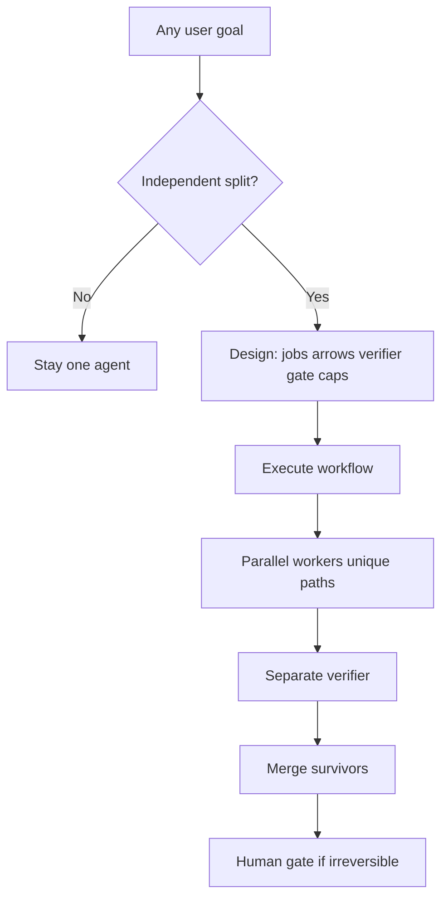

# 🕸️ Graph Engineer

### A workflow framework for autonomous agents — any goal, not a fixed task menu.

Teach Hermes to **design a graph** for your request, then **execute** it: parallel workers → separate verifier → one merged result → **your** last yes before anything irreversible.

> Hermes skill for **graph engineering**: boxes, real arrows, the diamond pattern, the stop rule, wiring guardrails, and human gates. Course builds (research / SEO / GTM) live under **Examples** only — they illustrate the pattern; they are not the product.

---

## ⚡ 60-second pitch

| Before | After |
|--------|--------|
| One agent. Straight line. Every step waits. | A **workflow**: invent jobs for *this* goal → fan-out → skeptic → merge → gate |
| Packaged “SEO skill” / “GTM skill” | One framework that fits **any** autonomous task |
| “And then…” everywhere | Only arrows where work actually flows |

**Default mode: Execute** = design the graph for your goal + run it now.

**Magic word in runnable prompts:** `use a workflow:`  
→ coordinated team, not a to-do list.

---

## 🚀 Install (2 minutes)

```powershell
# Windows
Copy-Item -Recurse skills\research\graph-engineer $HOME\.hermes\skills\research\graph-engineer
```

```bash
# macOS / Linux
mkdir -p ~/.hermes/skills/research
cp -r skills/research/graph-engineer ~/.hermes/skills/research/graph-engineer
```

Start a **new** Hermes session, then:

```text
/graph-engineer execute: analyze our churn drivers and propose 3 experiments
```

✅ Agent should announce **Execute**, sketch a custom diamond for *that* goal, then run it — not offer an SEO/GTM menu.

<details>
<summary>📦 Install from URL</summary>

```bash
hermes skills install https://github.com/kumanaya/graph-engineer/raw/main/skills/research/graph-engineer/SKILL.md
```

</details>

---

## 🎮 Try it

```text
▶️ /graph-engineer execute: compare three pricing options and recommend one with sources
▶️ /graph-engineer execute: triage this bug report — reproduce paths in parallel, then verify
🧹 /graph-engineer audit my current AI pipeline for fake edges
🧠 /graph-engineer teach me the stop rule
✏️ /graph-engineer design a weekly competitor watch graph (spec only, don't run)
```

---

## 🗺️ How it works



Hermes loads in layers (progressive disclosure):

```text
1️⃣  skills_list     → name + description
2️⃣  SKILL.md        → modes + hard rules + Execute procedure
3️⃣  references/*    → vocabulary, diamond, wiring, playbook  (on demand)
4️⃣  examples/*      → optional illustrations only
```

### Modes

| Mode | When | Result |
|------|------|--------|
| ▶️ **Execute** (default) | “Do this with a workflow” | Design graph for *this* goal → run it |
| ✏️ **Design** | “Spec / prompt only” | Filled `graph-spec.md` + paste-ready prompt |
| 🧹 **Audit** | “My pipeline feels slow” | Fake edges removed + one-agent vs diamond call |
| 🧠 **Teach** | “Explain diamond / gate / wiring” | One lesson; examples only if you ask |

---

## 🧱 Hard rules (always on)

| Rule | Plain English |
|------|----------------|
| 🛑 **Stop rule** | Graphs buy **breadth**, not better judgment. No split? Stay one agent. |
| ✂️ **Fake edges first** | If B doesn’t need A’s result, delete the wait. |
| 🚫 **No self-grading** | Verifier is a separate job. |
| ✅→🧩 **Verify, then merge** | Kill weak findings before synthesis. |
| 🔭 **Distinct lenses** | Different checker questions — adapted to the domain. |
| 🔌 **Wiring** | Loop cap · one writer per file · plan owns edges · spawn cap. |
| 🙋 **Human gate** | Last yes where undo is expensive. |
| 🧩 **No fixed menu** | Invent jobs for this request. Examples are not the product. |

**Default caps:** 🔁 3 loop rounds · 👥 5 parallel workers · 📝 1 writer per path

---

## 📚 Method: vocabulary

Six words explain every graph. Learn them in order.


| | Word | Meaning |
|---|------|---------|
| 1️⃣ | **Box** | One job for one assistant |
| 2️⃣ | **Arrow** | Hand-off only when work flows |
| 3️⃣ | **Running notes** | Found · decided · left |
| 4️⃣ | **Fake edge** | Arrow with no work — waste |
| 5️⃣ | **Diamond** | Split → parallel → verify → merge |
| 6️⃣ | **Gate** | Your last yes before irreversible |

📄 [`references/vocabulary.md`](skills/research/graph-engineer/references/vocabulary.md)

---

## 💎 Method: the diamond

```text
split ──► workers ┐
                  ├──► verifier (tries to kill) ──► merge ──► one trusted result
                  ┘
```


| ✅ Use when… | ❌ Skip when… |
|--------------|---------------|
| Jobs never read each other mid-flight | Step N must read step N−1 |
| You want breadth + ruthless check | Work is pure sequential judgment |

**Golden rule:** verify first, merge second.

📄 [`references/diamond-pattern.md`](skills/research/graph-engineer/references/diamond-pattern.md)

---

## 🔌 Method: wiring


| Guardrail | Do | Avoid |
|-----------|-----|--------|
| ⏱️ Loop cap | Max rounds + seen list | Infinite cycles |
| 📝 One writer / file | Unique paths → merge later | Parallel writes to one file |
| 🧭 Plan owns edges | Written if/else | Model invents next steps |
| 🚦 Spawn cap | Block overflow | Dozens of subagents for a simple ask |

📄 [`references/wiring-rules.md`](skills/research/graph-engineer/references/wiring-rules.md)

---

## ✏️ Design canvas

When you want the graph without running it (or as the checklist inside Execute):

📄 [`templates/graph-spec.md`](skills/research/graph-engineer/templates/graph-spec.md)

Goal → stop-rule check → jobs → edges → diamond → gate → caps → `use a workflow:` prompt.

---

## ✅ Playbook

1. ✂️ Fake edges first  
2. 🔀 Split only what never reads back  
3. 🛡️ No finding unchecked · distinct lenses  
4. ⏱️ Loop max rounds  
5. 📝 One writer per file · plan owns edges  
6. 🙋 Last yes where undo is expensive  
7. 🧰 One tool until you can name why not  

📄 [`references/playbook.md`](skills/research/graph-engineer/references/playbook.md)

---

## 📎 Examples (optional)

These show how the diamond looks in the wild. **They are not the Execute menu.** Load only when learning or asking for an illustration.

| Example | Illustrates | Card |
|---------|-------------|------|
| [Deep research desk](skills/research/graph-engineer/references/examples/deep-research-desk.md) | N angles → skeptic → ranked report → gate |  |
| [SEO content machine](skills/research/graph-engineer/references/examples/seo-content-machine.md) | Parallel research → draft → fact-check → never auto-publish |  |
| [Go-to-market kit](skills/research/graph-engineer/references/examples/go-to-market-kit.md) | Mid-graph pause → second fan-out → checker vs foundation |  |

```text
/graph-engineer teach me using the deep research example
```

For real work, stay generic:

```text
/graph-engineer execute: <your actual goal>
```

---

## 📁 Repo layout

```text
graph-engineer/
├── README.md
├── docs/images/                    ← method + example cards
└── skills/research/graph-engineer/
    ├── SKILL.md                    ← framework (Execute default)
    ├── references/
    │   ├── vocabulary.md
    │   ├── diamond-pattern.md
    │   ├── wiring-rules.md
    │   ├── playbook.md
    │   └── examples/               ← illustrations only
    └── templates/
        └── graph-spec.md
```

| Path | Role |
|------|------|
| `SKILL.md` | Always-loaded procedure |
| `references/*.md` | Method (on demand) |
| `references/examples/*` | Optional illustrations |
| `templates/graph-spec.md` | Design canvas |
| `docs/images/*` | Humans reading this README |

---

## 🚫 What this is not

- ❌ Not an SEO skill, GTM skill, or research skill  
- ❌ Not a LangGraph runtime — Hermes runs the procedure with its tools  
- ❌ Examples are not a product menu  

---

## 🏁 First move

```text
/graph-engineer audit my current AI system
```

Delete fake edges. Then:

```text
/graph-engineer execute: <the real job you need done>
```

Welcome to graph engineering. 🕸️
