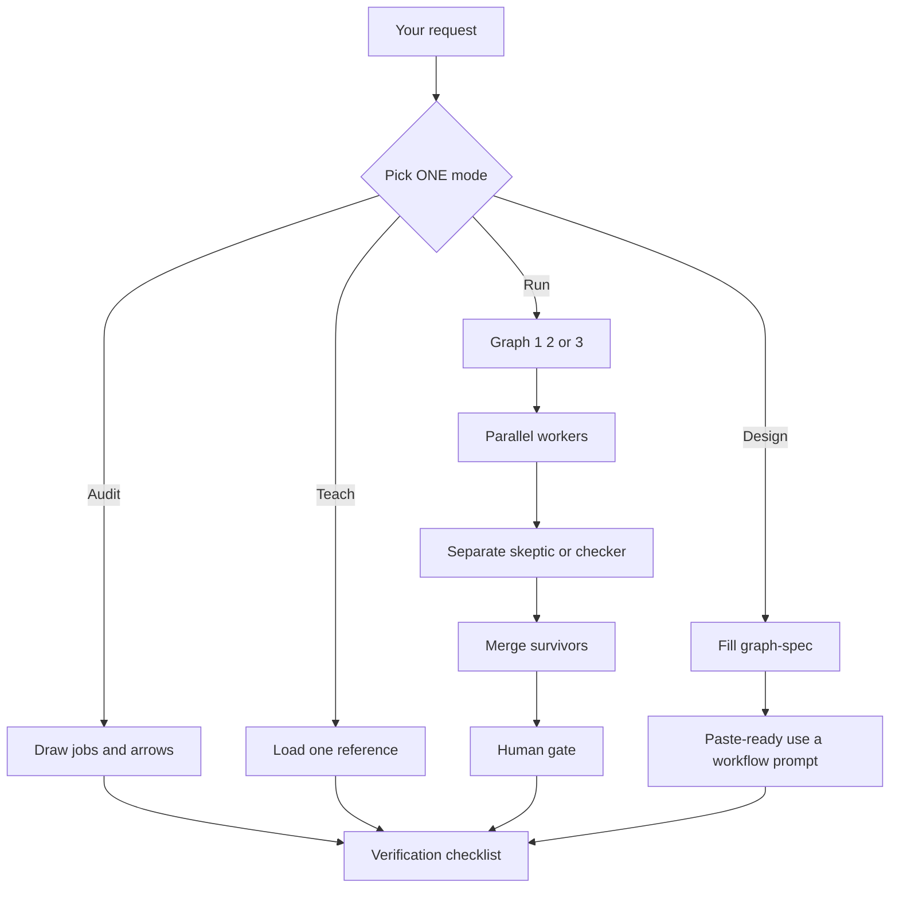
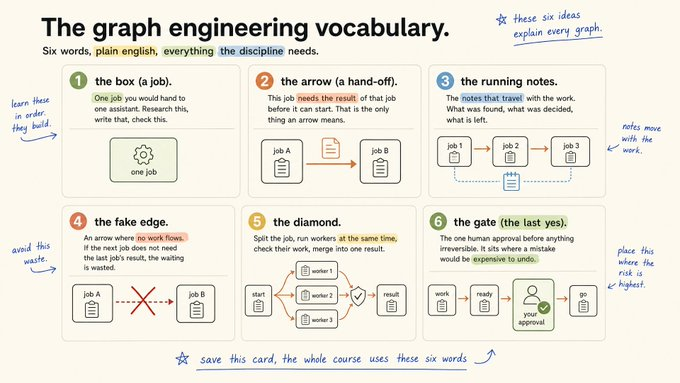
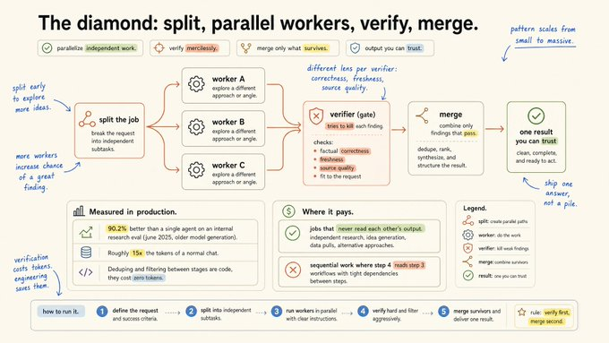
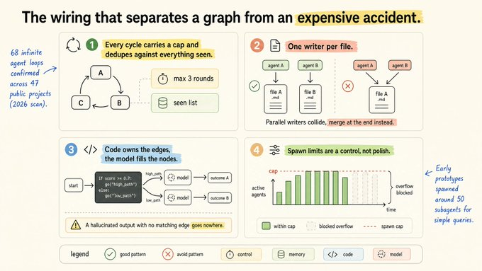
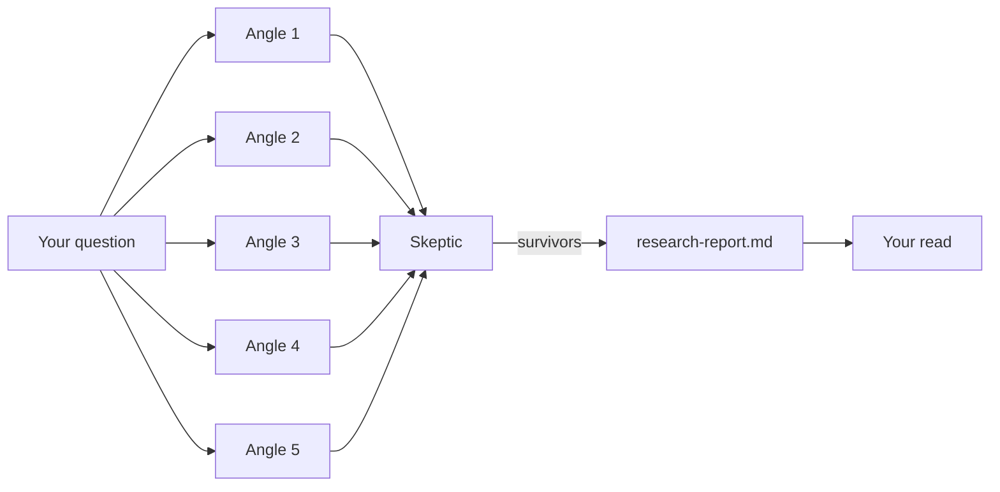

# 🕸️ Graph Engineer

### Teach your Hermes Agent to run a team — not a single straight line.

Research in parallel. Kill weak findings. Merge one result. **You** give the last yes before anything ships.

> A [Hermes Agent](https://hermes-agent.nousresearch.com/docs/guides/work-with-skills) skill for **graph engineering**: jobs, real arrows, the diamond pattern, the stop rule, wiring guardrails, and 3 business-ready builds.

---

## ⚡ 60-second pitch

| Before | After |
|--------|--------|
| One agent. Every step waits. Rumors sneak into the report. | A **workflow**: parallel workers → skeptic → one ranked result → **your gate** |
| “And then…” everywhere | Only arrows where work actually flows |
| Publish / send on autopilot | Human yes where a mistake is expensive to undo |

**One magic word in every run prompt:** `workflow`  
That tells the agent: *build a coordinated team, not a to-do list.*

---

## 🚀 Install (2 minutes)

**1. Copy the skill into Hermes**

```powershell
# Windows
Copy-Item -Recurse skills\research\graph-engineer $HOME\.hermes\skills\research\graph-engineer
```

```bash
# macOS / Linux
mkdir -p ~/.hermes/skills/research
cp -r skills/research/graph-engineer ~/.hermes/skills/research/graph-engineer
```

**2. Start a new Hermes session** (skills load at session start)

**3. Smoke test**

```text
/graph-engineer teach me the diamond
```

✅ You should see the agent announce **Teach** mode and explain split → workers → verify → merge.

<details>
<summary>📦 Install from a public URL instead</summary>

```bash
hermes skills install https://<your-host>/skills/research/graph-engineer/SKILL.md
hermes skills list
```

</details>

---

## 🎮 Try it now

Copy → paste → go.

```text
🔍 /graph-engineer run deep research on: should I raise my price 20% for annual plans?

✍️ /graph-engineer run SEO article for: b2b saas onboarding checklist

🚀 /graph-engineer run GTM kit for Acme CRM / mid-market ops leads

🧹 /graph-engineer audit my content pipeline for fake edges

🧠 /graph-engineer teach me the stop rule

✏️ /graph-engineer design a weekly competitor watch graph
```

---

## 🗺️ How the skill works

Hermes does **not** dump the whole course into every chat. It loads in layers:

```text
1️⃣  skills_list     → name + description only (cheap)
2️⃣  SKILL.md        → modes, hard rules, procedures
3️⃣  references/*    → vocabulary, diamond, wiring, graph maps  (on demand)
```



### The 4 modes

| Mode | Say this when… | You get… |
|------|----------------|----------|
| 🧹 **Audit** | “My AI system feels slow / messy” | Fake edges deleted + stay-one-agent vs diamond call |
| 🧠 **Teach** | “Explain the diamond / stop rule / gate” | One clear lesson — not a wall of text |
| ▶️ **Run** | “Do the research / SEO / GTM build” | Files on disk + a pause for your yes |
| ✏️ **Design** | “I need a custom graph” | Filled spec + a paste-ready workflow prompt |

---

## 🧱 Hard rules (always on)

Think of these as the seatbelt. The agent keeps them on in every mode.

| # | Rule | Plain English |
|---|------|----------------|
| 1 | 🛑 **Stop rule** | Graphs buy **breadth**, not better judgment. No independent split? Stay one agent. |
| 2 | ✂️ **Fake edges first** | “And then” ≠ dependency. If B doesn’t need A’s result, delete the wait. |
| 3 | 🚫 **No self-grading** | The writer never grades their own homework. Skeptic is a separate job. |
| 4 | ✅→🧩 **Verify, then merge** | Kill weak findings *before* synthesis. Ship one answer, not a pile. |
| 5 | 🔭 **Distinct lenses** | Correctness ≠ freshness ≠ source quality ≠ fit. Don’t ask the same question twice. |
| 6 | 🔌 **Wiring** | Loop cap · one writer per file · plan owns edges · spawn cap. |
| 7 | 🙋 **Human gate** | Last yes where undo is expensive — not everywhere, not nowhere. |

**Default caps:** 🔁 max **3** loop rounds · 👥 max **5** parallel workers · 📝 **1** writer per file path

---

## 📚 The vocabulary (6 words that explain every graph)

Learn these in order. They stack.



| | Word | Meaning | Memory hook |
|---|------|---------|-------------|
| 1️⃣ | **Box** | One job for one assistant | “Research this / write that / check this” |
| 2️⃣ | **Arrow** | Hand-off only when work flows | B **needs** A’s result — or it’s not an arrow |
| 3️⃣ | **Running notes** | Shared state on the move | Found · decided · left |
| 4️⃣ | **Fake edge** | Arrow with no work | Waiting for nothing = waste |
| 5️⃣ | **Diamond** | Split → parallel → verify → merge | The pattern that pays |
| 6️⃣ | **Gate** | Your last yes | Put it where a mistake hurts |

📄 Agent deep-dive: [`references/vocabulary.md`](skills/research/graph-engineer/references/vocabulary.md)

**Mini example — spot the fake edge**

```text
❌  Summarize the PDF  →  then check my calendar
    (calendar never needs the summary — fake edge)

✅  Run those two jobs side by side. No waiting.
```

---

## 💎 The diamond — the pattern that pays

```text
split ──► worker A ┐
          worker B ├──► verifier (tries to kill) ──► merge ──► one trusted result
          worker C ┘
```



| ✅ Use the diamond when… | ❌ Skip it when… |
|--------------------------|------------------|
| Jobs never read each other’s mid-flight output | Step 4 must read step 3 |
| Research angles, idea gen, data pulls | Tight sequential judgment |
| You want breadth + a ruthless check | Budget says “one pass only” |

**Golden rule:** verify first, merge second.

📄 [`references/diamond-pattern.md`](skills/research/graph-engineer/references/diamond-pattern.md)

---

## 🔌 Wiring — keep graphs from becoming expensive accidents



| Guardrail | Do this | Avoid this |
|-----------|---------|------------|
| ⏱️ **Loop cap** | Max 3 rounds + “seen” list | Infinite A→B→C→A |
| 📝 **One writer / file** | A→`a.md`, B→`b.md`, merge later | A and B both writing `a.md` |
| 🧭 **Plan owns edges** | Written if/else routing | Model invents next-step labels |
| 🚦 **Spawn cap** | Block overflow at the limit | 50 subagents for a simple ask |

📄 [`references/wiring-rules.md`](skills/research/graph-engineer/references/wiring-rules.md)

---

## 🏗️ Three ready-to-run graphs

### 1️⃣ Deep Research Desk

*Decision-grade research for questions with money behind them.*




| | |
|--|--|
| 🎯 **You bring** | One sentence question |
| 📁 **You get** | `research-report.md` ranked by confidence + sources |
| 🙋 **Gate** | You read before it enters a real decision |
| 💡 **Example** | `should I raise my price` · `which of these two offers do I launch` |

**Paste prompt** (swap the bracket):

```text
i need decision-grade research on: [your question]. use a workflow: split the question into 5 distinct angles, run one researcher per angle in parallel, every finding needs a source link and a date, then run a skeptic against each finding that tries to disprove it, drop what fails, merge the survivors into one report ranked by confidence, save it as research-report.md and show me the top findings
```

📄 [`deep-research-desk.md`](skills/research/graph-engineer/references/graphs/deep-research-desk.md)

---

### 2️⃣ SEO Content Machine

*One ranking-ready draft per run. Never publishes without you.*


```text
topic
  ├─ what top pages cover
  ├─ real questions people ask
  └─ what everyone misses
        ↓
     outline → draft → fact-checker
        ↓
     drafts/  (weak claims flagged at the top)
        ↓
     🙋 your yes → you publish
```

| | |
|--|--|
| 🎯 **You bring** | One topic / search intent |
| 📁 **You get** | Draft + outline + flags in `drafts/` |
| 🙋 **Gate** | You edit what only you know — then publish yourself |
| 💡 **Example** | `b2b saas onboarding checklist` |

**Paste prompt:**

```text
i want an article that can rank for: [topic]. use a workflow: run three research jobs in parallel, one lists what the current top-ranking pages cover, one collects the real questions people ask about this topic, one finds what the top pages skip, merge all three into an outline, write a full draft from the outline, then run a fact-checker that flags every claim without a source, save the draft to drafts/ with the flagged claims listed at the top, never publish anything
```

📄 [`seo-content-machine.md`](skills/research/graph-engineer/references/graphs/seo-content-machine.md)

---

### 3️⃣ Go-to-Market Kit

*Full launch kit — with a hard pause on positioning before any copy ships.*


```text
product + audience
  ├─ buyer & exact words
  ├─ where they hang out
  └─ how competitors pitch
        ↓
  one-page positioning  ★ PAUSE — you read this
        ↓
  ├─ landing copy
  ├─ week of launch posts
  └─ outreach messages
        ↓
  checker vs positioning → launch-kit/
        ↓
  🙋 approve piece by piece
```

| | |
|--|--|
| 🎯 **You bring** | Product + audience (one line each) |
| 📁 **You get** | Everything in `launch-kit/` |
| 🙋 **Gates** | (1) positioning page · (2) piece-by-piece before go-live |
| 💡 **Example** | `Acme CRM` for `mid-market ops leads` |

**Paste prompt:**

```text
i'm launching [product] for [audience]. use a workflow: run three research jobs in parallel, one profiles the buyer and collects the exact words they use, one maps where these buyers spend time online, one collects how competitors pitch them, merge into a one-page positioning doc and pause to show it to me, then run three writers in parallel from that doc: landing page copy, a week of launch posts, a set of outreach messages, then run a checker that compares every asset against the positioning doc and flags anything off, save everything to launch-kit/ and change nothing after that without asking me
```

📄 [`go-to-market-kit.md`](skills/research/graph-engineer/references/graphs/go-to-market-kit.md)

---

## ✏️ Design mode — build your own graph

None of the three fits? Design one.

1. Load [`templates/graph-spec.md`](skills/research/graph-engineer/templates/graph-spec.md)
2. Name the **boxes** · mark real vs **fake** arrows
3. Apply the **stop rule** (diamond only where work splits)
4. Place **verifier lenses** + the **human gate**
5. Set caps → get a paste-ready `use a workflow:` prompt

**Example ask:**

```text
/graph-engineer design a weekly competitor watch graph
that alerts me only when pricing or positioning changes
```

---

## ✅ Playbook (run this order every time)

1. ✂️ Fake edges first  
2. 🔀 Split only what never reads back  
3. 🛡️ No finding unchecked · distinct checker questions  
4. ⏱️ Every loop has a max rounds  
5. 📝 One writer per file · plan owns the edges  
6. 🙋 Last yes where undo is expensive  
7. 🧰 One tool is enough until you can name why it isn’t  

📄 Full checklist: [`references/playbook.md`](skills/research/graph-engineer/references/playbook.md)

---

## 📁 What’s in the repo

```text
graph-engineer/
├── README.md                 ← you are here
├── docs/images/              ← course cards (for humans)
└── skills/research/graph-engineer/
    ├── SKILL.md              ← always-loaded procedure
    ├── references/           ← lessons + graph maps (on demand)
    │   ├── vocabulary.md
    │   ├── diamond-pattern.md
    │   ├── wiring-rules.md
    │   ├── playbook.md
    │   └── graphs/
    │       ├── deep-research-desk.md
    │       ├── seo-content-machine.md
    │       └── go-to-market-kit.md
    └── templates/
        └── graph-spec.md     ← blank design canvas
```

| Path | Who reads it |
|------|----------------|
| `SKILL.md` | Hermes, every time the skill fires |
| `references/*` | Hermes, only when that lesson/graph is needed |
| `docs/images/*` | You (this README) |
| `templates/graph-spec.md` | Hermes in Design mode |

---

## 🚫 What this is not (v1)

- ❌ Not a LangGraph / orchestration runtime — Hermes **runs the procedure** with its own tools  
- ❌ Not a Cursor-only skill — plain markdown; Hermes-first  
- ❌ Images don’t drive the agent — the `.md` references do  

---

## 🏁 First move tonight

Draw your current AI system. **Jobs + arrows only.**

Count the fake edges. Delete them.

That usually removes more waiting than any tool you could buy.

Then:

```text
/graph-engineer audit my current AI system
```

Welcome to graph engineering. 🕸️
