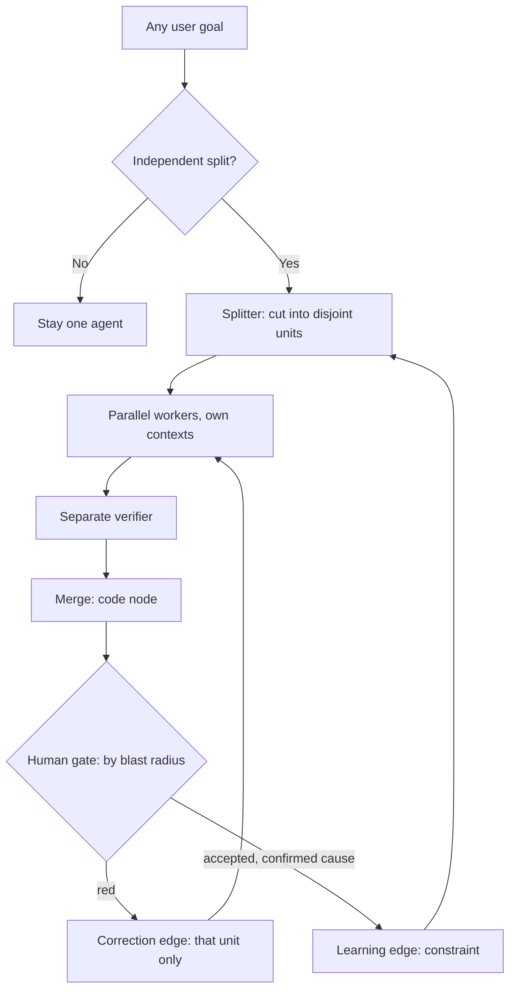
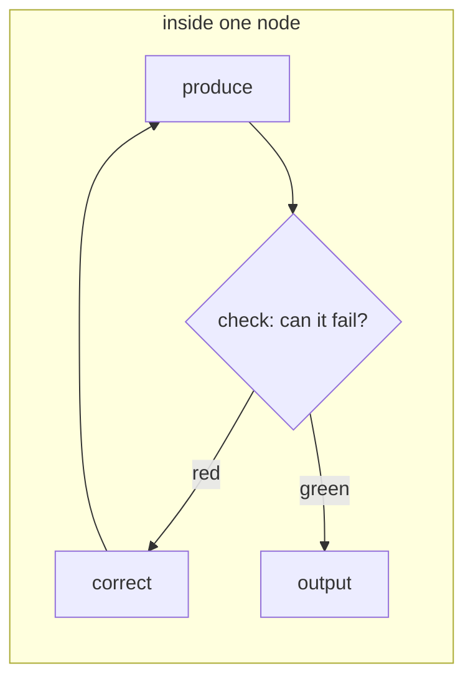

# graph-engineer

**A workflow framework for autonomous agents.** It designs a graph for the job in front of it, runs it, and asks you for one approval instead of every step.

[](skills/research/graph-engineer/SKILL.md)
[](skills/research/graph-engineer/SKILL.md)
[](skills/research/graph-engineer/SKILL.md)
[](#repo-layout)

> [!NOTE]
> Not an SEO skill, not a GTM skill, not a research skill. Those live in [`references/examples/`](skills/research/graph-engineer/references/examples/) as illustrations of the pattern. The product is the framework.

---

## Contents

| | |
|---|---|
| [What it is](#what-it-is) | [Install](#install) |
| [Vocabulary](#vocabulary) | [Use](#use) |
| [The loop](#the-loop) | [Design canvas](#design-canvas) |
| [The graph](#the-graph) | [Playbook](#playbook) |
| [Node kinds](#node-kinds) | [Examples](#examples) |
| [Return paths](#return-paths) | [Repo layout](#repo-layout) |
| [The gate](#the-gate) | [What this is not](#what-this-is-not) |
| [Hard rules](#hard-rules) | [Changelog](#changelog) |

---

## What it is

Two things stop an agent from needing a babysitter, and almost everyone builds only one of them.

| Layer | The question it answers | Where it lives |
|-------|------------------------|----------------|
| **Loop** | Is this one unit of work correct? | inside a node |
| **Graph** | Which units exist, in what order, and what happens when one fails? | between nodes |

A loop without a graph is one very good step in a queue nobody designed. A graph without loops ships unverified work in parallel — worse than serially, because there is more of it.[^1]

**graph-engineer is the procedure for both**, packaged as a [Hermes](https://github.com/kumanaya) skill: it teaches the agent to design a graph for *your* request, execute it as a coordinated team, and stop at the one gate that matters.



And the layer underneath it — where the loop actually lives:



---

## Vocabulary

Nine words explain the whole discipline. Six describe the shape of a graph, three more make it run.


| | Word | Meaning |
|---|------|---------|
| 1 | **Box** | One job for one assistant |
| 2 | **Arrow** | A hand-off, only when work flows |
| 3 | **Running notes** | What was found, decided and left — travels with the work |
| 4 | **Fake edge** | An arrow with no work: pure waste |
| 5 | **Diamond** | Split → parallel → verify → merge |
| 6 | **Gate** | Your last yes before anything irreversible |
| 7 | **Loop** | Produce → check → correct, inside a box |
| 8 | **Code node** | Merge · rank · dedupe · route — not a model |
| 9 | **Return edges** | Correction for this run, learning for every run after |

→ [`references/vocabulary.md`](skills/research/graph-engineer/references/vocabulary.md)

---

## The loop

```text
produce ──► check ──► correct ──► repeat until green
              │
        can it fail while you are away?
        no → it is a scheduler, not a loop
```

> [!IMPORTANT]
> The check is the whole thing. Write the condition **before** the work, and write it so a program could evaluate it.

| GREEN — a program can settle it | NOT A CHECK |
|---------------------------------|-------------|
| the test suite exits 0 | the output looks good |
| every claim carries a source line | the model says it is confident |
| the diff touches only files in the plan | no errors were raised |

> [!CAUTION]
> That last one catches careful people. Absence of an error is not evidence of correctness. Build a loop on it and you get a system that repeats the mistake confidently, with a clean log, until the budget runs out.

**The ceiling.** A loop makes one unit better. It cannot choose the units, their order, or notice that two steps never needed to wait for each other. A very good agent running the wrong three steps in the wrong order is a graph problem — tuning the loop will never fix it.

**The cap.** 3 rounds, then stop correcting: a unit that fails three times is not failing, the plan that produced it is.

→ [`references/loop-design.md`](skills/research/graph-engineer/references/loop-design.md)

---

## The graph

A graph is the shape of the work: what runs, what runs at the same time, what waits, and where results go back.

$$G = (N, E), \qquad (a,b) \in E \iff b \text{ consumes the output of } a$$

That single rule kills most wasted time in existing pipelines:

```diff
- summarize the file
- then check the weather
+ summarize the file
+ check the weather          # no edge between them — the weather never reads the summary
```

Run it on every arrow you already have: **can you name the variable that crosses?** If you cannot, there is no edge, and the wait is pure waste.


**The diamond** is the pattern that pays: split → parallel workers → separate verifier → merge. Verify first, merge second.

| Use it when | Skip it when |
|-------------|--------------|
| Jobs never read each other mid-flight | Step N must read step N−1 |
| You want breadth plus a ruthless check | The work is pure sequential judgment |

→ [`references/diamond-pattern.md`](skills/research/graph-engineer/references/diamond-pattern.md)

---

## Node kinds

Four kinds. One of them is not a model.

| Node | Job | Written by |
|------|-----|-----------|
| **Splitter** | Cuts the work into units — decides more than any other node | plan |
| **Worker** | One unit, one lens, its own context | model |
| **Code node** | Merge · dedupe · rank · compare · filter · route | code |
| **Gate** | One human yes, where undo is expensive | human |

A **verifier** is a worker whose lens is "kill this". The **merge** is usually a code node, not a model call.

> [!TIP]
> If you can describe the transformation without the words *judge*, *decide*, *assess* or *summarize*, it is code. A graph where every node is a model pays rent on its own wiring.

**Splitting.** Cut by the dimension where two workers cannot return the same finding — by subsystem × concern, by claim, by source class, or by blast radius. Cut a repository by folder and four workers audit the same three files.

**Context.** Give four workers a shared window and they converge: the first writes a finding, the rest read it, and all four reports centre on the same thing. Separate context + distinct question + disjoint split.

→ [`references/node-types.md`](skills/research/graph-engineer/references/node-types.md)

---

## Return paths

A graph without a way back is a pipeline: it produces output and forgets.

| Edge | Length | Carries | Fixes |
|------|--------|---------|-------|
| **Correction** | short: gate → the node that produced the unit | the failed unit, with its verdict and evidence | this run |
| **Learning** | long: accepted result → the splitter's brief | a constraint derived from it | every run after |

> [!WARNING]
> **Return the unit, not the batch.** Four slices ported, one fails — send the batch back and three correct slices get rewritten, re-verified, and any of them may fail the next time for unrelated reasons. One failure becomes four uncertain outcomes. Do it twice and it never converges.

Five fields travel with a return:

| Field | Example |
|-------|---------|
| **UNIT** | handlers slice |
| **VERDICT** | red |
| **REASON** | `test_auth_redirect` failed |
| **EVIDENCE** | expected 302, got 200, `handlers/auth.py:88` |
| **SCOPE** | fix this file only, do not touch other slices |

**SCOPE matters more than it looks.** Without it the agent opens the file, notices two adjacent issues, fixes those too, and your one-slice correction becomes a four-file diff nobody reviewed.

A verdict that does not change what runs next is a report.

→ [`references/return-paths.md`](skills/research/graph-engineer/references/return-paths.md)

---

## The gate

Open on **blast radius**, not confidence — confidence is the only input in that decision the model can influence.

| Lane | What lands here | What the gate does |
|------|-----------------|--------------------|
| Reversible, contained | a copy change, a test, an isolated function | opens first |
| Reversible, wide | a shared utility, a schema addition, a dozen callers | opens on deterministic checks plus a clean trajectory |
| Hard to reverse | migrations, deletions, production data, money | **does not open** |

The third row is not a threshold set very high. It is a lane that does not open — and thresholds get adjusted, closed lanes do not.

Inside an open lane, the gate reads in order: **deterministic results → this run's trajectory → this node's rollback history → the model's own assessment (last)**.

> [!IMPORTANT]
> A human in the middle of a graph becomes the slowest node in it, and the graph runs exactly as fast as a person reads things. Approve the merge. Choose which fixes ship. Never send, publish, refund, invoice, or go live without explicit approval.

→ [`references/gate-design.md`](skills/research/graph-engineer/references/gate-design.md)

---

## Hard rules

Always on, in every mode.

| # | Rule | Plain English |
|---|------|---------------|
| 1 | **Stop rule** | Graphs buy breadth, not better judgment. No split? Stay one agent. |
| 2 | **Check first** | Name the green condition before the work. "No errors were raised" is not a check. |
| 3 | **Loop in the box** | Produce → check → correct inside a node; split, fan-out and gate between nodes. |
| 4 | **Fake edges first** | If B does not need A's result, delete the wait. |
| 5 | **No self-grading** | The verifier is a separate job. |
| 6 | **Verify, then merge** | Kill weak findings before synthesis. |
| 7 | **Distinct lenses** | Different checker questions, adapted to the domain. |
| 8 | **Own context** | Four workers in one window buy one opinion and three echoes. |
| 9 | **Disjoint split** | Split by the dimension where two workers cannot return the same finding. |
| 10 | **Code node** | Dedupe, rank, compare, route: one right answer = code, not a model. |
| 11 | **Return the unit** | A failed unit goes back to its producer, never the batch. |
| 12 | **Wiring** | Loop cap + seen list · one writer per file · plan owns edges · spawn cap. At the cap, the plan is at fault. |
| 13 | **Human gate** | Opened by blast radius, never by confidence. |
| 14 | **Irreversible actions** | Never send, publish, refund, invoice, or go live without explicit approval. |
| 15 | **No fixed menu** | Invent jobs for this request. Examples are not the product. |

**Default caps:** 3 loop rounds (then escalate to the plan) · 5 parallel workers · 1 writer per path.


Four guardrails keep a graph from becoming an expensive accident: every cycle carries a cap and a seen list · one writer per file, merge at the end · code owns the edges, the model fills the nodes · spawn limits are a control, not polish.

→ [`references/wiring-rules.md`](skills/research/graph-engineer/references/wiring-rules.md)

---

## Install

<details open>
<summary><b>Windows</b></summary>

```powershell
Copy-Item -Recurse skills\research\graph-engineer $HOME\.hermes\skills\research\graph-engineer
```

</details>

<details>
<summary><b>macOS / Linux</b></summary>

```bash
mkdir -p ~/.hermes/skills/research
cp -r skills/research/graph-engineer ~/.hermes/skills/research/graph-engineer
```

</details>

<details>
<summary><b>From URL</b></summary>

```bash
hermes skills install https://github.com/kumanaya/graph-engineer/raw/main/skills/research/graph-engineer/SKILL.md
```

</details>

> [!TIP]
> Start a **new** session afterwards. The skill list is read at startup, so an open session will not see it.

The agent loads the skill in layers — name and description first, `SKILL.md` when it applies, `references/*` only when the question needs them, examples only on request.

---

## Use

Say the magic word in any runnable prompt:

```text
use a workflow: <your actual goal>
```

Or address the skill directly:

```text
/graph-engineer execute: compare three pricing options and recommend one with sources
/graph-engineer execute: triage this bug report — reproduce paths in parallel, then verify
/graph-engineer audit my current AI pipeline for fake edges
/graph-engineer audit my loop — is anything in it able to fail?
/graph-engineer design a weekly competitor watch graph (spec only, don't run)
/graph-engineer teach me the two return edges
```

| Mode | When | Result |
|------|------|--------|
| **Execute** (default) | "Do this with a workflow" | Designs the graph for this goal, then runs it |
| **Design** | "Spec / prompt only" | A filled spec plus a paste-ready prompt |
| **Audit** | "My pipeline feels slow" | Fake edges removed · unfailable steps flagged · one-agent vs graph call |
| **Teach** | "Explain the gate / the diamond / wiring" | One lesson, from the right reference |

An Execute run looks like this: the agent announces the mode, sketches the graph for *your* goal, writes the green condition for each job, fans out workers with separate contexts, runs a separate verifier, merges survivors, and stops at the gate.

---

## Design canvas

[`templates/graph-spec.md`](skills/research/graph-engineer/templates/graph-spec.md) is the checklist behind every run — goal → stop-rule check → green conditions → jobs and node kinds → edges → diamond → return paths → gate lane → caps → runnable prompt.

Fill it when you want the graph without running it, or use it as the mental checklist inside Execute.

---

## Playbook

- [ ] 1. Write the check first — a condition a program can settle
- [ ] 2. Fake edges first
- [ ] 3. Split only what never reads back, by a disjoint dimension
- [ ] 4. No finding unchecked · distinct lenses · own contexts
- [ ] 5. Loop max rounds — at the cap, the plan is at fault
- [ ] 6. Return the unit, not the batch
- [ ] 7. One writer per file · plan owns edges · deterministic steps are code
- [ ] 8. Last yes where undo is expensive — by blast radius
- [ ] 9. One tool until you can name why not

Starting from nothing, build in this order: **the check first** (everything gets easier once something can fail loudly), **then the split**, **then the learning edge last** — you cannot derive constraints from accepted results until something is accepting results.

→ [`references/playbook.md`](skills/research/graph-engineer/references/playbook.md)

---

## Examples

Illustrations of the pattern in the wild. **Not** the Execute menu — load them when learning, not when working.

<details>
<summary><b>Deep research desk</b> — N angles → skeptic → ranked report → gate</summary>


Every finding needs a source link and a date; a skeptic tries to disprove each one; survivors merge into one ranked report; the human reads before anything is treated as decided.

[`references/examples/deep-research-desk.md`](skills/research/graph-engineer/references/examples/deep-research-desk.md)

</details>

<details>
<summary><b>SEO content machine</b> — parallel research → draft → fact-check → never auto-publish</summary>


Three independent research jobs merge into an outline; a separate fact-checker flags every claim without a source; the publish gate is a hard-to-reverse lane that does not open on its own.

[`references/examples/seo-content-machine.md`](skills/research/graph-engineer/references/examples/seo-content-machine.md)

</details>

<details>
<summary><b>Go-to-market kit</b> — mid-graph pause → second fan-out → checker vs foundation</summary>


Research merges into a one-page positioning doc, then a **mandatory human pause**, then parallel producers and a checker that compares every asset against the foundation.

[`references/examples/go-to-market-kit.md`](skills/research/graph-engineer/references/examples/go-to-market-kit.md)

</details>

---

## Repo layout

```text
graph-engineer/
├── README.md
├── docs/images/                    ← method and example cards
└── skills/research/graph-engineer/
    ├── SKILL.md                    ← the framework (Execute is the default)
    ├── references/
    │   ├── vocabulary.md           ← the shape, then the machinery
    │   ├── loop-design.md          ← produce → check → correct
    │   ├── node-types.md           ← splitter · worker · code node · gate
    │   ├── diamond-pattern.md      ← split · fan out · verify · merge
    │   ├── gate-design.md          ← lanes by blast radius
    │   ├── return-paths.md         ← correction and learning edges
    │   ├── wiring-rules.md         ← caps, writers, deterministic routing
    │   ├── playbook.md             ← the operational checklist
    │   └── examples/               ← illustrations only
    └── templates/
        └── graph-spec.md           ← design canvas
```

| Path | Role |
|------|------|
| `SKILL.md` | Always-loaded procedure: modes, hard rules, Execute/Design/Audit/Teach |
| `references/*.md` | The method, loaded on demand |
| `references/examples/*` | Optional illustrations, never the product |
| `templates/graph-spec.md` | Design canvas |
| `docs/images/*` | Cards for humans reading this README |

---

## What this is not

- Not an SEO, GTM, or research skill — those are examples of the pattern.
- Not a runtime. It is a procedure the agent follows with the tools it already has, not a LangGraph-style library.
- Not "more agents is better". The stop rule is the first rule for a reason.
- Not a way to remove the human. It is a way to move the human to the one step that matters.

---

## Changelog

| Version | What changed |
|---------|--------------|
| **3.0.0** | The loop half: green conditions written first, the loop placed inside the node, node kinds (one of them not a model), gate lanes by blast radius, and the two return edges. |
| **2.0.0** | The graph half: diamond, wiring rules, stop rule, human gates, design canvas. |
| **1.0.0** | Initial skill with the vocabulary and the example cards. |

---

## First move

```text
/graph-engineer audit my current AI system
```

Delete the fake edges, then find the steps nothing can fail. Then run the real job:

```text
/graph-engineer execute: <the job you actually need done>
```

[^1]: The framing "the loop lives inside a node, the graph lives between them" comes from the *Loops and Graphs* thread. The graph vocabulary predates it — graphs are decades-old dependency plans wearing a new name, which is the good news: the pattern already runs critical systems.
