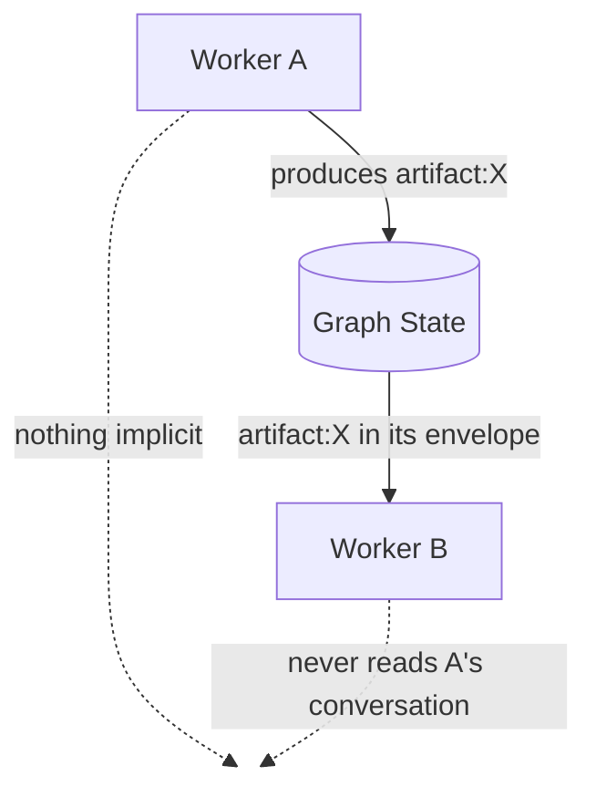
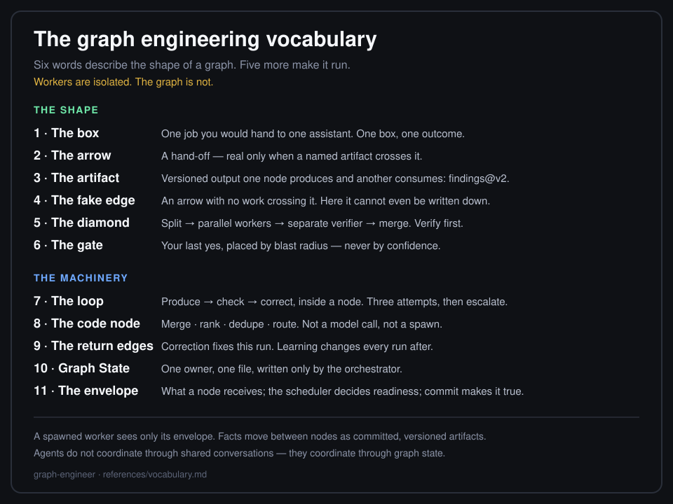
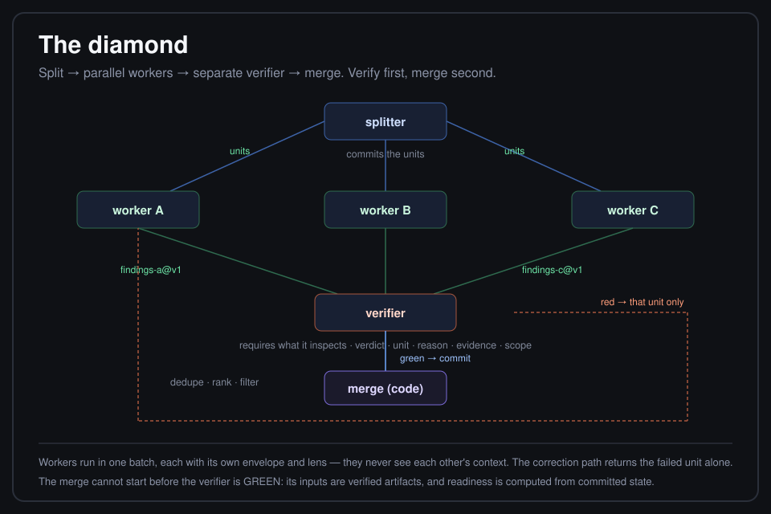
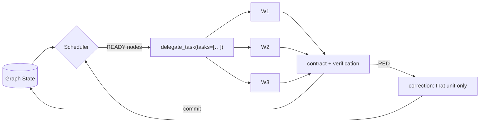
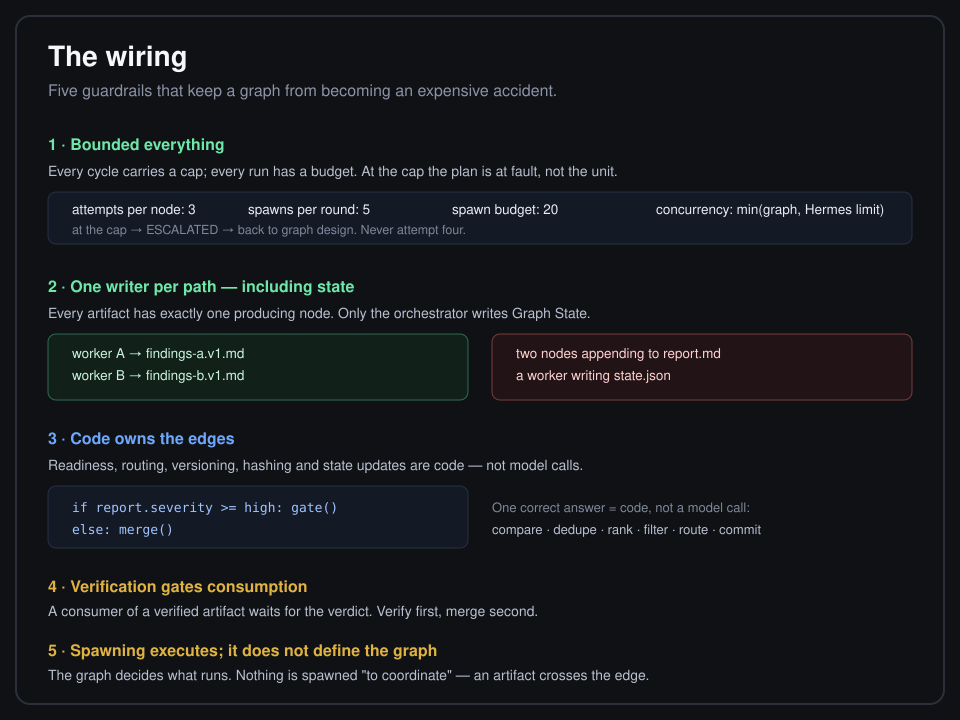
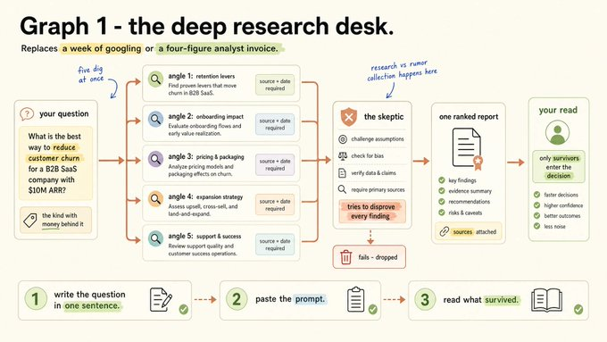
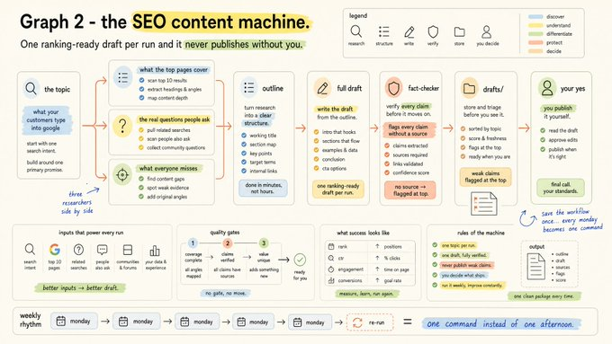
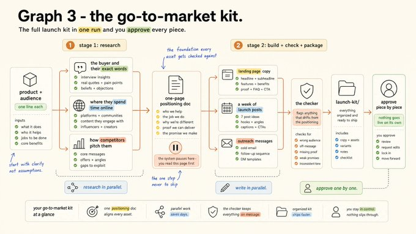

# graph-engineer

**A workflow framework for autonomous agents that treats subagents as what they are: isolated.** It designs a graph for the job in front of it, owns the state the workers cannot share, runs the graph, and asks you for one approval instead of every step.

[](skills/research/graph-engineer/SKILL.md)
[](skills/research/graph-engineer/SKILL.md)
[](skills/research/graph-engineer/SKILL.md)
[](#repo-layout)

> [!NOTE]
> Not an SEO skill, not a GTM skill, not a research skill. Those live in [`references/examples/`](skills/research/graph-engineer/references/examples/) as illustrations of the pattern. The product is the framework.

---

## Contents

| | |
|---|---|
| [What it is](#what-it-is) | [Install](#install) |
| [The invariant](#the-invariant) | [Use](#use) |
| [Vocabulary](#vocabulary) | [Design canvas](#design-canvas) |
| [The loop](#the-loop) | [Playbook](#playbook) |
| [The graph](#the-graph) | [Examples](#examples) |
| [Node kinds](#node-kinds) | [Validation](#validation) |
| [Graph State](#graph-state) | [Hermes limits](#hermes-limits) |
| [The scheduler](#the-scheduler) | [Repo layout](#repo-layout) |
| [Return paths](#return-paths) | [What this is not](#what-this-is-not) |
| [The gate](#the-gate) | [Changelog](#changelog) |
| [Hard rules](#hard-rules) | [First move](#first-move) |

---

## What it is

Two things stop an agent from needing a babysitter, and almost everyone builds only one of them.

| Layer | The question it answers | Where it lives |
|-------|------------------------|----------------|
| **Loop** | Is this one unit of work correct? | inside a node |
| **Graph** | Which units exist, in what order, and what happens when one fails? | between nodes |

A loop without a graph is one very good step in a queue nobody designed. A graph without loops ships unverified work in parallel — worse than serially, because there is more of it.

**graph-engineer is the procedure for both**, packaged as a [Hermes](https://github.com/kumanaya) skill. It teaches the agent to design a graph for *your* request, own the state its workers cannot share, execute the graph node by node, and stop at the one gate that matters.

---

## The invariant

Hermes subagents start with a **completely fresh conversation**. A child agent does not share:

```text
the parent's conversation        another worker's context
another worker's discoveries     the current state of the graph
decisions made by siblings       anything that was not handed to it
```

So the whole design follows from one sentence:

> **Workers are isolated. The graph is not.**

The orchestrator owns the graph and moves every fact between nodes on purpose.



**BAD**

```text
Worker A discovers X
Worker B is expected to somehow know X        ← there is no channel for this
```

**GOOD**

```text
Worker A ──artifact:X──▶ Graph State ──artifact:X──▶ Worker B
```

Two bad outcomes are equally real, and both are fixed the same way:

| Written as | Actually happens |
|------------|------------------|
| "Worker B picks up where A left off" | B starts blank and guesses, or invents |
| "The verifier sees the findings" | The verifier sees only what its envelope carried |
| "Workers coordinate on the split" | They can't — they converge or they diverge |
| "State lives in the context" | Context is per-agent and gets compacted; state must be on disk |

The fix is not a bigger prompt and not more duplicated history. It is explicit state.

→ [`references/isolation.md`](skills/research/graph-engineer/references/isolation.md)

---

## Vocabulary

Eleven words. Six describe the shape of a graph; five make it run.



| | Word | Meaning |
|---|------|---------|
| 1 | **Box** | One job for one assistant |
| 2 | **Arrow** | A hand-off — real only when a named artifact crosses it |
| 3 | **Artifact** | Versioned output one node produces and another consumes |
| 4 | **Fake edge** | An arrow with no work: pure waste, and unwritable here |
| 5 | **Diamond** | Split → parallel → verify → merge |
| 6 | **Gate** | Your last yes before anything irreversible |
| 7 | **Loop** | Produce → check → correct, inside a node |
| 8 | **Code node** | Merge · rank · dedupe · route — not a model |
| 9 | **Return edges** | Correction for this run, learning for every run after |
| 10 | **Graph State** | The orchestrator's authoritative record of what happened |
| 11 | **Envelope · Scheduler · Commit** | What a node receives, what decides readiness, what makes a result true |

→ [`references/vocabulary.md`](skills/research/graph-engineer/references/vocabulary.md)

---

## The loop

```text
produce ──► check ──► correct ──► repeat until green
              │
        can it fail while you are away?
        no → it is a scheduler, not a loop
```

> [!IMPORTANT]
> The check is the whole thing. Write the condition **before** the work, and write it so a program could evaluate it.

| GREEN — a program can settle it | NOT A CHECK |
|---------------------------------|-------------|
| the test suite exits 0 | the output looks good |
| every claim carries a source line | the model says it is confident |
| the diff touches only files in the plan | no errors were raised |

> [!CAUTION]
> That last one catches careful people. Absence of an error is not evidence of correctness. Build a loop on it and you get a system that repeats the mistake confidently, with a clean log, until the budget runs out.

**The cap.** 3 attempts, then stop correcting: a unit that fails three times is not failing, the plan that produced it is. The node escalates and the graph goes back to design.

→ [`references/loop-design.md`](skills/research/graph-engineer/references/loop-design.md)

---

## The graph

A graph is the shape of the work: what runs, what runs at the same time, what waits, and where results go back.

$$G = (N, E), \qquad (a,b) \in E \iff b \text{ consumes the output of } a$$

And the edge now has to say **what crosses it**:

```text
A ── artifact:auth-findings@v2 ──▶ B
```

That single rule kills most wasted time in existing pipelines:

```diff
- summarize the file
- then check the weather
+ summarize the file
+ check the weather          # no edge between them — the weather never reads the summary
```

**Execution order is not a dependency.** Run it on every arrow you already have: *can you name the artifact that crosses?* If you cannot, there is no edge.

This skill goes one step further than asking nicely: **an ordering-only edge cannot be written down.** Nodes declare `requires` (artifacts), and the producer of each required artifact *is* the dependency. There is no `depends_on`, no `after`, no priority field — `init` rejects unknown keys. Fake edges are unrepresentable, not merely discouraged.



**The diamond** is the pattern that pays: split → parallel workers → separate verifier → merge. Verify first, merge second.

| Use it when | Skip it when |
|-------------|--------------|
| Jobs never read each other mid-flight | Step N must read step N−1 |
| You want breadth plus a ruthless check | The work is pure sequential judgment |

→ [`references/diamond-pattern.md`](skills/research/graph-engineer/references/diamond-pattern.md)

---

## Node kinds

Five kinds. One is not a model, and one is not an agent.

| Node | Job | Executed by | Spawned? |
|------|-----|-------------|----------|
| **Splitter** | Cuts the work into units — decides more than any other node | model | yes |
| **Worker** | One unit, one lens, its own envelope | model | yes |
| **Verifier** | A worker whose lens is "kill this" | model | yes |
| **Code node** | Merge · dedupe · rank · compare · filter · route | code | no |
| **Gate** | One human yes, where undo is expensive | human | never |

Every kind declares the same four things: **inputs**, **green condition**, **output contract**, **writer path**.

> [!TIP]
> If you can describe the transformation without the words *judge*, *decide*, *assess* or *summarize*, it is code. Code nodes are not spawned at all — the orchestrator runs them with `execute_code`/`terminal`, so they cost no context and no tokens.

**Splitting.** Cut by the dimension where two workers cannot return the same finding — by subsystem × concern, by claim, by source class, or by blast radius. Cut a repository by folder and four workers audit the same three files.

**Context.** Give four workers a shared window and they converge: the first writes a finding, the rest read it, and all four reports centre on the same thing. Separate envelope + distinct lens + disjoint split.

→ [`references/node-types.md`](skills/research/graph-engineer/references/node-types.md)

---

## Graph State

Nothing is true because a worker said so. Something is true when the orchestrator **commits** it.

```text
worker result ──▶ contract validation ──▶ verification if declared ──▶ commit ──▶ Graph State
```

```text
Workers produce outputs. The orchestrator commits them.
```

| Rule | Why |
|------|-----|
| **One writer** | Only the orchestrator writes `state.json`. Three agents rewriting it is a race with no owner |
| **One writer per path** | Each node writes exactly one artifact, at the path its envelope named — the commit step compares the two |
| **Versioned, never overwritten** | A correction produces `v2`; `v1` stays on disk. No ambiguous overwriting |
| **One producer per artifact** | Otherwise "which version is real" is undecidable |
| **Verified or unverified** | If an artifact declares a verifier, consumers wait for the verified version |
| **Referenced, not pasted** | Envelopes carry id, version, path, hash — not 40 KB of text |

The commit step is code, not a model call: parse the contract, validate it, confirm the artifact exists, hash it, assign the version, re-arm the verifier, unblock consumers, append to the history. **One correct answer means code.**

**Reopening committed work is explicit.** If accepted output turns out to be wrong, `reopen --node … --reason …` is the only way a GREEN node runs again: the reason is recorded, its consumers are flagged stale, and the rewrite needs `--supersedes`. There is no silent re-run and no quiet overwrite.

→ [`references/graph-state.md`](skills/research/graph-engineer/references/graph-state.md)

---

## The scheduler

Graph Engineer does not spawn a group of agents and hope they coordinate.



A node is **READY** when every required input is committed — and, where a verifier is declared, verified. Readiness is computed from state, never remembered:

| Status | Meaning |
|--------|---------|
| `PENDING` | an input is not committed yet; the record names which |
| `READY` | every required input is committed and verified |
| `RUNNING` | dispatched; an attempt is open |
| `GREEN` | committed: contract valid, artifact on disk, verification passed |
| `RED` | failed, or a verifier rejected this unit — correctable while attempts remain |
| `BLOCKED` | an upstream producer died terminally; this node will not run on incomplete inputs |
| `ESCALATED` | attempts exhausted: stop correcting, return to graph design |
| `WAITING_HUMAN` | a gate — no model can open it |

A diamond then behaves exactly as the dataflow says:

```text
ROUND 1   split                    → commit
ROUND 2   wa + wc  (one batch)     → commit both        ← they never communicate
ROUND 3   verify   (needs both)    → commit verdict
ROUND 4   merge    (code node)     → commit report
ROUND 5   gate     (human)
```

Status is inspectable while it runs, and every wait explains itself:

```text
GRAPH: repo-audit  [running]

READY
  ○ audit-auth              artifact: auth-findings@v1 (unverified)
PENDING
  ○ merge-report            — auth-findings@latest is not verified yet (verifier: verify-findings)
GREEN
  ✓ inventory               artifact: inventory@v1
  ✓ verify-findings         artifact: findings-verdict@v1
```

→ [`references/scheduler.md`](skills/research/graph-engineer/references/scheduler.md)

---

## Return paths

A graph without a way back is a pipeline: it produces output and forgets.

| Edge | Length | Carries | Fixes |
|------|--------|---------|-------|
| **Correction** | short: verifier → the node that produced the unit | the failed unit, its verdict, evidence, scope, and the latest artifact version | this run |
| **Learning** | long: an accepted outcome → `constraints.json` → every later envelope | a constraint, promoted by a human | every run after |

> [!WARNING]
> **Return the unit, not the batch.** Four slices ported, one fails — send the batch back and three correct slices get rewritten, re-verified, and any of them may fail the next time for unrelated reasons. One failure becomes four uncertain outcomes.

Here that is structural, not a policy: the verdict names exactly one `unit`, and only that node goes RED. A verifier cannot reject "everything" — `init` refuses a verdict contract without `unit`.

Five fields travel with a return:

| Field | Example |
|-------|---------|
| **UNIT** | `auth-findings` |
| **VERDICT** | red |
| **REASON** | `test_auth_redirect` failed |
| **EVIDENCE** | expected 302, got 200, `handlers/auth.py:88` |
| **SCOPE** | fix this file only, do not touch other slices |

The corrected node also receives its own previous artifact version, and produces a **new** one. The verifier then re-arms automatically, because a new version invalidates the old verdict.

**A verdict that does not change what runs next is a report.**

→ [`references/return-paths.md`](skills/research/graph-engineer/references/return-paths.md)

---

## The gate

Open on **blast radius**, not confidence — confidence is the only input in that decision the model can influence.

| Lane | What lands here | What the gate does |
|------|-----------------|--------------------|
| Reversible, contained | a copy change, a test, an isolated function | opens first |
| Reversible, wide | a shared utility, a schema addition, a dozen callers | opens on deterministic checks plus a clean trajectory |
| Hard to reverse | migrations, deletions, production data, money | **does not open** |

The third row is not a threshold set very high. It is a lane that does not open — and the state script enforces it: approving a hard-to-reverse gate is refused unless the approval carries a quote of your own words.

A gate can also **hold the graph**: declare a `decision` artifact on it, make the nodes after it require that artifact, and the scheduler will not release them until you answer. `status` then reads `PENDING — gate publish-gate has not been answered yet`, a rejection shows them as `BLOCKED`, and a later explicit approval releases them. A mid-graph pause becomes a real dependency instead of a promise to stop.

Before a gate opens, the summary is assembled **from committed state**: what ran, what passed, what failed, what was corrected, which artifact versions are being accepted, which deterministic checks passed, what remains uncertain, what happens after approval, and whether it is reversible.

> [!IMPORTANT]
> No worker can approve anything: subagents cannot talk to the user. Every gate is handled by the orchestrator in its own turn. Never delegate a decision.

→ [`references/gate-design.md`](skills/research/graph-engineer/references/gate-design.md)

---

## Hard rules

Always on, in every mode.

| # | Rule | Plain English |
|---|------|---------------|
| 1 | **Workers are isolated** | A worker may rely only on its envelope |
| 2 | **Stop rule** | Graphs buy breadth, not better judgment. No split? Stay one agent |
| 3 | **Check first** | Name the green condition before the work. "No errors were raised" is not a check |
| 4 | **Loop in the node** | Produce → check → correct inside a node; split, fan-out and gate between nodes |
| 5 | **Fake edges first** | Name the artifact that crosses, or delete the wait |
| 6 | **One writer** | One producer per artifact; only the orchestrator writes state |
| 7 | **No self-grading** | The verifier is a separate node that requires the artifact |
| 8 | **Verify before consume** | Consumers wait for the verified version |
| 9 | **Distinct lenses** | Different checker questions, adapted to the domain |
| 10 | **Own envelope** | Separate context + distinct lens + disjoint split |
| 11 | **Code node** | Dedupe, rank, compare, route, and state updates: one right answer = code |
| 12 | **Return the unit** | A failed unit goes back to its producer, never the batch |
| 13 | **Learning changes envelopes** | Only a human promotes a constraint |
| 14 | **Wiring** | Attempt cap + spawn cap + spawn budget. At the cap, the plan is at fault |
| 15 | **Human gate** | Opened by blast radius, never by confidence |
| 16 | **Irreversible actions** | Never send, publish, refund, invoice, or go live without explicit approval |
| 17 | **No fixed menu** | Invent nodes for this request. Examples are not the product |

**Default caps:** 3 attempts per node (then escalate) · 5 concurrent spawns per round · 20 spawns per run · 1 writer per path.



→ [`references/wiring-rules.md`](skills/research/graph-engineer/references/wiring-rules.md)

---

## Install

<details open>
<summary><b>Windows</b></summary>

```powershell
Copy-Item -Recurse skills\research\graph-engineer $HOME\.hermes\skills\research\graph-engineer
```

</details>

<details>
<summary><b>macOS / Linux</b></summary>

```bash
mkdir -p ~/.hermes/skills/research
cp -r skills/research/graph-engineer ~/.hermes/skills/research/graph-engineer
```

</details>

<details>
<summary><b>From URL</b></summary>

```bash
hermes skills install https://github.com/kumanaya/graph-engineer/raw/main/skills/research/graph-engineer/SKILL.md
```

</details>

> [!TIP]
> Start a **new** session afterwards. The skill list is read at startup, so an open session will not see it.

The agent loads the skill in layers — name and description first, `SKILL.md` when it applies, `references/*` only when the question needs them, examples only on request. The bundled scripts run directly:

```bash
python ${HERMES_SKILL_DIR}/scripts/graph_state.py --root .graph status
```

---

## Use

Say the magic word in any runnable prompt:

```text
use a workflow: <your actual goal>
```

Or address the skill directly:

```text
/graph-engineer execute: compare three pricing options and recommend one with sources
/graph-engineer execute: triage this bug report — reproduce paths in parallel, then verify
/graph-engineer audit my current AI pipeline for fake edges
/graph-engineer audit my pipeline — which workers assume they can see each other's work?
/graph-engineer design a weekly competitor watch graph (spec only, don't run)
/graph-engineer teach me the two return edges
```

| Mode | When | Result |
|------|------|--------|
| **Execute** (default) | "Do this with a workflow" | Designs the graph, validates the spec, runs the scheduler, stops at the gate |
| **Design** | "Spec / prompt only" | A filled canvas, a validated `graph.json`, and a paste-ready prompt |
| **Audit** | "My pipeline feels slow" | Fake edges removed · unfailable steps flagged · missing envelopes found |
| **Teach** | "Explain the gate / the diamond / wiring" | One lesson, from the right reference |

An Execute run looks like this: announce the mode, apply the stop rule, write the green condition and contract per node, validate the spec with `init`, dispatch the ready nodes as one `delegate_task` batch, run the code nodes locally, commit every result from disk, return only failed units, merge survivors, and stop at the gate with a summary assembled from committed state.

---

## Design canvas

Every node answers the same eight questions:

```text
NODE            what exact job does it perform?
KIND            splitter / worker / verifier / code / gate
INPUTS          which artifacts does it require?
GREEN CONDITION what objectively means success?
OUTPUT CONTRACT what exactly must it produce?
DEPENDENCIES    derived from those artifacts — not written by hand
CONTEXT         the minimum that must be in its envelope
FAILURE         where does RED go?
WRITER          what may it modify?
```

Every edge answers four:

```text
FROM  →  TO  →  CARRIES (artifact)  →  REQUIRED / OPTIONAL
```

If `CARRIES` cannot be filled in, the edge is fake.

→ [`templates/graph-spec.md`](skills/research/graph-engineer/templates/graph-spec.md) · [`templates/node-contract.md`](skills/research/graph-engineer/templates/node-contract.md)

---

## Playbook

- [ ] 1. Write the check first — a condition a program can settle
- [ ] 2. Fake edges first — name the artifact or delete the wait
- [ ] 3. Split only what never reads back, by a disjoint dimension
- [ ] 4. Give every node an envelope it could succeed from alone
- [ ] 5. No finding unchecked · distinct lenses · verify before consume
- [ ] 6. Attempt cap — at the cap, the plan is at fault
- [ ] 7. Return the unit, not the batch · one writer per path, including state
- [ ] 8. Deterministic steps are code, including the graph's own bookkeeping
- [ ] 9. Last yes where undo is expensive — by blast radius
- [ ] 10. One tool until you can name why not

Starting from nothing, build in this order: **the check first**, **then the split**, **then verification**, **then the learning edge last** — you cannot derive constraints from accepted results until something is accepting results.

→ [`references/playbook.md`](skills/research/graph-engineer/references/playbook.md)

---

## Examples

Illustrations of the pattern in the wild. **Not** the Execute menu — load them when learning, not when working.

<details>
<summary><b>Isolated workers</b> — five worked examples: parallel, real dependency, diamond, correction, fake edge</summary>

Round-by-round traces, real envelopes, and the exact commands. Includes the two tasks that looked sequential and exchanged nothing — and why that edge cannot even be written down.

[`references/examples/isolated-workers.md`](skills/research/graph-engineer/references/examples/isolated-workers.md)

</details>

<details>
<summary><b>Deep research desk</b> — N angles → skeptic → ranked report → gate</summary>



Every finding needs a source link and a date; a separate skeptic node requires the committed findings and tries to disprove each one; survivors merge into one ranked report; the human reads before anything is treated as decided.

[`references/examples/deep-research-desk.md`](skills/research/graph-engineer/references/examples/deep-research-desk.md)

</details>

<details>
<summary><b>SEO content machine</b> — parallel research → draft → fact-check → never auto-publish</summary>



Three independent research nodes merge into an outline; a separate fact-checker flags every claim without a source; the publish gate is a hard-to-reverse lane that does not open on its own.

[`references/examples/seo-content-machine.md`](skills/research/graph-engineer/references/examples/seo-content-machine.md)

</details>

<details>
<summary><b>Go-to-market kit</b> — mid-graph pause → second fan-out → checker vs foundation</summary>



Research merges into a one-page positioning doc, then a **mandatory human pause**, then parallel producers and a checker that compares every asset against the committed foundation.

[`references/examples/go-to-market-kit.md`](skills/research/graph-engineer/references/examples/go-to-market-kit.md)

</details>

---

## Validation

The execution semantics are executable, not just documented. `scripts/selftest.py` drives the real CLI with simulated isolated children and asserts the seven scenarios that matter:

| # | Scenario | What it proves |
|---|----------|----------------|
| 1 | Three independent workers | all READY in one round → one batch → verifier gates merge → gate last; then a promoted constraint reaches a later graph's envelope |
| 2 | `A → B` | B cannot be dispatched before A's artifact is committed |
| 3 | Diamond `A → {B,C} → D` | B and C dispatch together; D's envelope carries both committed artifacts; the spawn cap defers instead of oversubscribing; reopening committed work flags its consumer and needs `--supersedes` |
| 4 | Verifier rejects B | only B returns; C does not rerun; D stays PENDING until corrected B is verified |
| 5 | Attempts exhausted | ESCALATED, downstream BLOCKED, graph returns to design, no further spawns |
| 6 | Sequential but no data crossing | the edge cannot be written down — `init` rejects it |
| 7 | Irreversible action | the hard-to-reverse lane refuses to open without the user's own words, and nothing downstream of the gate runs until they are given |

```bash
python skills/research/graph-engineer/scripts/selftest.py
# all 7 scenarios passed
```

---

## Hermes limits

What the runtime gives, what it does not, and where the line sits.

**Solved inside Graph Engineer:** isolated workers · cross-node knowledge transfer · state ownership · determinism · contract enforcement · bounded execution · worktree isolation.

**Would require Hermes core changes** (documented, never depended on): a structured child-result payload · a per-task model override · a session-scoped shared state store with a single-writer lease · a declared artifact contract per task · an in-turn wait for top-level batches · durable execution.

→ [`references/hermes-runtime.md`](skills/research/graph-engineer/references/hermes-runtime.md)

---

## Repo layout

```text
graph-engineer/
├── README.md
├── docs/images/                    ← method and example cards
└── skills/research/graph-engineer/
    ├── SKILL.md                    ← the framework (Execute is the default)
    ├── references/
    │   ├── isolation.md            ← the invariant, envelopes, context policy
    │   ├── graph-state.md          ← state, artifacts, versions, the commit step
    │   ├── scheduler.md            ← readiness, rounds, failure semantics, caps
    │   ├── hermes-runtime.md       ← what Hermes actually provides, and its limits
    │   ├── vocabulary.md           ← the shape, then the machinery
    │   ├── loop-design.md          ← produce → check → correct
    │   ├── node-types.md           ← splitter · worker · verifier · code node · gate
    │   ├── diamond-pattern.md      ← split · fan out · verify · merge
    │   ├── gate-design.md          ← lanes by blast radius
    │   ├── return-paths.md         ← correction and learning edges
    │   ├── wiring-rules.md         ← caps, writers, deterministic routing
    │   ├── playbook.md             ← the operational checklist
    │   └── examples/               ← illustrations only
    ├── scripts/
    │   ├── graph_state.py          ← Graph State, scheduler and commit step (stdlib only)
    │   └── selftest.py             ← the seven execution scenarios
    └── templates/
        ├── graph-spec.md           ← design canvas
        └── node-contract.md        ← output contracts per node kind
```

| Path | Role |
|------|------|
| `SKILL.md` | Always-loaded procedure: modes, hard rules, Execute/Design/Audit/Teach |
| `references/*.md` | The method, loaded on demand |
| `references/examples/*` | Optional illustrations, never the product |
| `scripts/graph_state.py` | The deterministic half: envelopes, readiness, commits, status |
| `templates/*` | Design canvas and contract shapes |
| `docs/images/*` | Cards for humans reading this README |

---

## What this is not

- Not an SEO, GTM, or research skill — those are examples of the pattern.
- Not a distributed system. There is no broker, no queue, no daemon: one JSON file, written by one agent, plus artifacts on disk.
- Not a LangGraph-style library. It is a procedure the agent follows with the tools it already has, plus one stdlib-only script.
- Not "more agents is better". The stop rule is the first rule for a reason.
- Not a way to remove the human. It is a way to move the human to the one step that matters.
- Not a fix for isolation by sharing everything. Sharing the conversation would destroy the fan-out: isolated reasoning plus explicit coordination, never shared reasoning plus implicit coordination.

---

## Changelog

| Version | What changed |
|---------|--------------|
| **4.0.0** | Built for isolated subagents: Graph State with a single writer, versioned artifacts, Node Input Envelopes, an explicit scheduler with READY/BLOCKED/ESCALATED semantics, commit-as-code (`scripts/graph_state.py`), fake edges made unrepresentable, correction envelopes carrying versions, learning constraints promoted into future envelopes, and seven executable scenarios. |
| **3.0.0** | The loop half: green conditions written first, the loop placed inside the node, node kinds, gate lanes by blast radius, and the two return edges. |
| **2.0.0** | The graph half: diamond, wiring rules, stop rule, human gates, design canvas. |
| **1.0.0** | Initial skill with the vocabulary and the example cards. |

---

## First move

```text
/graph-engineer audit my current AI system
```

Delete the fake edges, then find the steps nothing can fail — and the workers that assume they can see each other. Then run the real job:

```text
/graph-engineer execute: <the job you actually need done>
```
